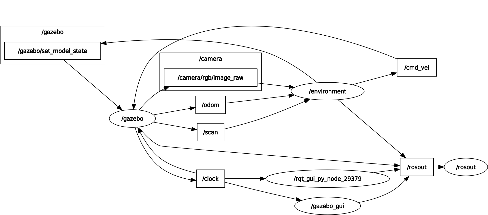

# Minimizing Time For Maze Completition with Deep-Deterministic Policy Gradients

## Owen Karpf & Rohan Voddhi

# Project Description

### Project Goal

The general idea for our project is that we wanted to use reinforcement learning to constantly set linear and angular velocities for a turtlebot3 robot such that the linera and angular velocities minimized the time necessary for the turtlebot to reach the goal. Due to impracticalities in regards to training time (navigation of the entire maze would take thousands upon thousands of iterations, if it worked at all), along with issues in actually tuning our model, we decided to constrain ourself towards having the robot learn to reach the end goal from specific starting positions. Although this means the task doesn't generalize well (e.g. we likely can't have the robot finish the maze from a random position), it the idea for our project actually feasible.

### Why We Chose This Idea

We chose this project idea for two primary reasons. First, we thought it served as an evolutionary step of the q-learning project as it required us to go more in-depth with reinforcement learning and work extensively with deep learning variants of reinforcement algorithms. This enabled us to learn more about actual implementation of deep-learning systems, along with working extensively with simulated enviroments. Secondly, we thought the task was pretty cool as once the robot was able to succesfully navigate the maze from a start-point in an optimal (or at least semi-optimal) fashion, we should be able to train the robot to do the same task on a race-track. As a result, the task would generalize well to other enviroments so long as the robot was then trained within those enviroments first.

### Project Components

#### Environment

In order to train our model, we needed to create a simulation enviroment. The actual enviroment will be described further in the System Architecture section, but the core idea was that we needed an enviroment that enabled us to pause and unpause the world to allow gradient updates to take place and for the model to take the input and determine the next action that should be taken.

#### DDPG Algorithm Implementation

We use Deep Deterministic Policy Gradients as our core algorithm to determine the linear and angular velocities at a given point in time. We chose this algorithm as it allows for a continous state-space to be used. 

#### Training Loop

The training loop is used in tandem with the model implementation and the enviroment in order to train our model to complete the task from various start points within the maze.

### What We Were Able to Make Our Robot Do

Sadly, we had limited success in actually getting our implementation working correctly. After many, many different attempts at training the model and modifying the model, we succeeded at having the robot go relatively close to the goal (but not reach the goal) after making a singular turn and in having our robot reward hack its way into spinning in circles and never crashing into a wall.

#### GIFS 

##### GIF of Robot Almost Reaching Goal

##### GIF of Robot Spinning in Circles

# System Architecture

### Gazebo Environment

##### General Overview of The Environment

We used a Gazebo environment in order to generate a space in which we could run training simulations. The environment lives inside the models.py file in the Enviroment class. The general idea behind the environment was that we wanted to be able to update the robot's linear and angular velocities within Gazebo following an action being generated by our DDPG model, keep track of the state of the model (get LIDAR readings, determine if wall was hit or if we reached the goal object). To do so, we had the environment run as a ROS node with publishers for the velocity and subscribers and associated callback functions for the lidar, camera and then also odometer (even though the odometer wasn't used in our final version of the DDPG model). Additionally, we determined the reward for an action within the environment, reset the world after the conclusion of a training iteration, and actually launched the Gazebo world.

##### Resetting the World and Determining if a Wall was Reached or if Goal was Reached

To reset the world, we used a Gazebo service proxy for resetting Gazebo worlds, which returned the world to its initial state that was used in the launch file. Additionally, we implemented capabilities to randomly spawn in a set of pre-determined different locations upon world reset, but chose to have the robot spawn only in one location to narrow the scope of our project to a feasible one. All of this was done in the reset_world function of the Environment class.

Going hand-in-hand with resetting world were the functions to determine if a wall or the goal was reached. For determining if a wall was reached, we used the is_at_wall method within the Environment class which checked to see if any LIDAR ranges were less than a threshold of .17 meters, and if they were, used that to say the robot was at the wall. For determining if the goal was reached, we used a combination of checking for if an object was directly in front of the robot and using the camera output to see if the colored wall the robot was trying to detect was directly in front of it. This was all within the is_at_target method within the Environment class.

##### Performing an Action

To perform the action, we began by publishing the linear and angular velocity of the action determined by our model. With that done, we then unpaused the physics of the Gazebo world, enabling the action to actually be carried out, slept for a very small amount of time, and then paused the world physics again. State was then recorded (both the LIDAR state, whether the given trial was completed and the reward for performing the given action). All of this was within our perform_action function in the Environment class.

##### Determining Reward

The method for determining the reward can be found in the determine_reward function of the Environment class. The general idea of the reward is that we wanted to incentivize high linear speeds, penalize turning, penalize hitting a wall, reward seeing the end goal and reward reaching the end goal. Additionally, we wanted the reward for reaching the goal to be remarkably high so that the robot would be able to realize that it did indeed want to reach the end goal. We penalized turning as we wanted the robot to take as direct a path as possible.

##### Launching the Gazebo World

Launching the Gazebo World was done in the initialization of the Environment Class. We used the subprocess module to run the command line arguments to launch a modified version of the maze (modified with the addition of a blue end goal) as seen below.

### DDPG Algorithm and Training Loop

For this project, we used a deep determinsitic policy gradient algorithm (DDPG). The is a type of
reinforcement learning model that is meant for continuous action spaces where the agent needs to learn
the reward function as well. There are a couple main components to this a DDPG model: 
- Actor Network (Ouputs the optimal action for a given state)
- Critic Network (Learns the reward function over time and outputs the estimated Q for a givens state
and action)
- Target Actor and Critic Networks (Copies of the actor and critic networks that are updated slowly to
avoid training instabilities)
- Replay Buffer (Stores the transitions of (state, action, reward, new state) to sample from in the 
training process)
- Exploratory Noise (Used to get the agent to explore the environment and potentially better paths)
- Navigation Network (the full model that combines the different actor and critic components)

##### DDPG Algorithm Implementation

###### Actor Network
The actor network is a sequential model with a couple linear layers and the ReLU activation function
between hidden layers. The final activation is a tanh followed by a custom Scale layer that scales the 
output into the valid action space for the turtlebot. The actor network takes in the state and outputs
an action to take. 

###### Critic Network
The critic network is a sequential model with two hidden layers. The input is the current state
and the action to take and the output is an estimate of the q value. The goal of the critic network
is to learn how to approximate the reward function properly.

###### Target Actor and Critic Networks
When we update the actor and critic networks we copy over a fraction (Tau) of the weights
from the actor and critic network to the target actor and critic network. This because of the fact
that in such a large continious space it is very possible for the network to get stuck down a wrong
path. By copying a fraction of the weights we are then increasing the training time in exchange for 
more stability in training. We experimnted with different values of Tau and it would be interesting to run
a cross-validation on the different values to see what results in an optimal learning strategy.

###### Navigation Network
The navigation network is what brings all the different networks together and trains them. It contains 
an actor network, a critic network, Adam optimizers for both, and the target actor critic networks. This
is the network that is saved and loaded from file system for checkpointing purposes. This also is the
interface for the core model logic. This is repsonible for training the invidiual actor and critic 
networks. We define critic loss as the MSE loss between the q values from  the target crtic and the 
regular critic and we backprop on this. For the actor, we want to maximize the q value so we do gradient
ascent on the reward. This is also where we update the target actor and critic networks as described above.

###### Replay Buffer
The purpose of the replay buffer is to have the network keep training based on data it has seen before
while preventing it from learning temporal dependcies. If we were to train in order of each (state, action,
reward) then the model could learn the temporal relations between them. To avoid this from happening, 
we add each (state, action, reward) to the replay buffer and after a fixed number of iterations, we sample
from the replay buffer and use that data to train our model. The replay buffer has a fixed size that 
we varied through different iterations. The buffer follows a FIFO (first in, first out) eviction policy,
so the size matters because it affects for how long we can train on older data. Ideally, we would be able
to run a proper cross-validation scheme to find the optimal buffer size.

###### Scaling and Adding Noise
This is used to add the exploratory noise in the second phase of training (see next section). Here, we add
exploration noise to the action vector. We sample from a normal distribution for the linear and angular
noises (with different variance to account for the differening sizes of their respective action spaces).
We then add the noise to the action vector and clip it so that it is within the valid action space. 

Although, we ended up using a normal distribution for noise, there are other possible alternatives
that could be looked into. Uniform distributions could be used to encourage more exploration of action 
space. Temporally correlated noise is another method that we read about which would make it easier for
the robot to make smooth turns as it would be less jerky (i.e. step 0 is -1 angular velocity and step 1
as +1 angular velocity isn't particularlry useful, autocorrelated noise could be more useful)

###### Training Loop
Our training loop has the robot go through many sample iterations. In each sample iteration, we discretize time into a fixed segment where the robot performs an action, after which we update state,
receive a reward, and choose a new action to perform. Each state, action, and reward are stored
in the replay buffer and used to train our overall navigational model.

There are two phases to the training loop. In the initial phase, we just want to have our robot explore
the state and action space and get many different rewards so it can have sufficient data for when it 
starts training. The idea behind this is that we do not want the model to fit closely to its first couple
trials of training data, that reduces the chance of getting a good starting network. In this phase,
at each time step of each iteration an action is uniformly sampled from the action space. Because
of this methodology the model is expected to learn the reward structure pretty well. However, it takes a
significant number of "warmup" iterations for this to happen (many thousands). We tested with as many as
500 and were still barely able to map a quarter of the entire maze. At the end of this phase we start to train on the information stored in the replay buffer. The idea is that now the replay has a more uniform
distribution of actions and rewards to sample from so our model will be trained better.

The second phase to the training loop is to add exploratory noise to the actions suggested from the model.
The idea behind this is to use the navigational model to guide the robot, but to add noise on the way. The
intuition for this is that the model will slowly learn an idea of how to get to the goal, but we want to
add noise so it can discover slightly better paths each time. This is the phase where the continual training of the model happens, every 10 iteartions we update the model based on a sample of the replay
buffer.

We also checkpoint our mode to local storage every 25 sample iterations.

### Running in the Real World

Our implementation for running in the real world was relatively simple. All code for this resides in the RunModelWorld. It begins by setting up the velocity publisher and LIDAR and camera subscribers. Additionally, a trained actor network is loaded in with the correct weights.  After initialization, the run_model function is called, which runs the model until competition (either wall is hit or goal is reached). Within this function, at each iteration, the state is recorded and then passed to the actor network, which determines the action to take. This action is then scaled before being published. The action is then performed while the script sleeps for a small amount of time, before we check for if a wall or the goal is reached. If so, we terminate, otherwise keep running this perform action loop.

# ROS Node Diagram

Below is our graph of the ROS Nodes and Topics. It was generated using rqt_graph.

# Execution

First, "owenkarpf" or "rvoddhi" will have to be replaced in file paths to your username within the world file "modified_world.world". From there, you can just run the runner shell script within the main directory, which will train the model. If you want to train the model a second time, you will have to run the killer shell script as otherwise there are weird gazebo errors that arise. For testing within gazebo, run "./test.sh {ITER_NUM}" with ITER_NUM corresponding to the iteration at which the model was saved at. For example, for the model within the repo, run "./test.sh 395". Finally, for running in the real world with a trained model, run roscore, connect to the robot (run both bringup and bringup_cam) and then run. Next, change the path to the actor model within the real_world.py file to the correct one. Finally, run the command "rosrun final_project real_world.py". 

# Challenges

### Gazebo Challenges

##### Setting up the Gazebo World

Initially, we wanted the robot to receive a reward for following a general path by denoting the path as a certain color. Unfortunately, Gazebo provides a very poor world-editing experience, meaning that we couldn't directly apply the color to the floor. Following that, we tried adding an additional layer on-top of the default floor and then coloring that, but physics interactions between objects led to bumps in the floor that the robot either couldn't drive over or would drive over in a weird way that led to it turning in a way that it wasn't supposed to. As a result, we had to abandon the colored floor idea and instead decided to simply add a colored wall to denote the reward.

##### Gazebo World Glitches 

Gazebo had a glitch within it that led to weird simulation behavior. If the robot ran into a wall at a high enough speed, it would see what was on the other side of the wall through its camera. This resulted in our robot sometimes being mis-rewarded with having reached the goal or seeing the goal when it did not in fact achieve such a thing. Below is a GIF of such a thing occurring.

### Training Challenges

##### Narrow Maze

In an ideal world, we'd want our robot to easily explore the entire maze with just a small bit of noise being added in for the sake of exploration. Unfortunately, we made the mistake of working with the maze that had been created for the particle filter. Using this maze proved problematic as the areas in which the robot would drive through were thin, leading to the robot frequently crashing with a wall, ending a training simulation and preventing the robot from exploring further. This hampered our robot's exploration, limiting the Q-values it was able to achieve and the different states it was able to experience.

##### Hyper-Parameter Tuning

In an ideal world, we'd be able to perform a grid search to optimize the extensive list of hyper-parameters we are working with (layer sizes, amount of the actual networks we want to copy to the target networks, learning rates, etc) by running variants of the training in parallel across many different computing clusters. In practice, this wasn't feasible, so hyper-parameter tuning had to be done by hand. This was both inefficient and also had the added problem of being nowhere near as precise as running many different trainings at the same time with the only difference being the hyper-parameters.

##### Training Time

Unsurprisingly, training time for our model was quite high. Not only did each iteration take a decent amount of time due to it needing to be physically run in Gazebo, but training to convergence took many thousands of iterations. This not only led to a training time bottleneck, but also slowed down our iteration process, as we couldn't determine if a given set of hyper-parameters or a given change was working as intended after only a short number of trials.

 
##### Reward Hacking

The final challenge we faced was the issue of reward hacking. Throughout our time attempting to train the model to successfully navigate the maze in as fast a time as possible, we ran into continuous issues with reward hacking. For example, the robot spinning in circles above is an example of reward hacking, where the robot figured out that by spinning in circles ad infinitum, it would receive a high reward as the linear reward and reward for seeing the end goal outweighed the penalty for turning. Another example was when the robot's camera glitched through the wall in the Gazebo world by running into the wall really fast and then subsequently achieved a high reward for seeing the goal, the robot attempted to do this continuously.

# Future Work

In terms of future work, we'd like to go back and actually get the model implementation working correctly. Ideally, we'd begin by attempting to use another robotics simulator that is more geared towards running a large number of trials in an efficient way. Additionally, we'd like to sample a large number of different reward functions to see if any of those achieve better results. Finally, we'd like to create an environment with less narrow passage-ways so that the robot would be able to explore more of the environment before hitting a wall and having to reset. 

# Takeaways

1. Deep Learning is often very inefficient and time consuming without extensive compute resources.

2. Model Optimization is very difficult to do in practice, and can be a real performance bottleneck even when your general architectural structure is correct.

3. Pair programming isn't an efficient use of time when working on training a model, as it's much better for each to try different set-ups and different model variations with a bunch of small changes implemented. 
